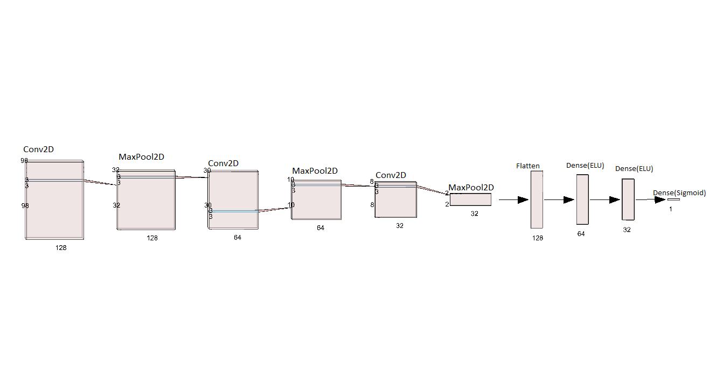

# DRIVER-DROWSINESS-DETECTION-APP 🚀🚗

### <b>INTRODUCTION</b> ⚡📑-
<bl>
The risk, danger, and often tragic results of drowsy driving are alarming. Drowsy driving is the dangerous combination of driving and sleepiness or fatigue. This usually happens when a driver has not slept enough, but it can also happen because of untreated sleep disorders, medications, drinking alcohol, or shift work
 
Hence this drowsiness app's primary focus is solve this problem using Machine Learning & Deep Learning Techiniques.
   
   
  

 

  <h2> Working Of The App </h2>
  
  <bl>
  
  <h4>1.Detection Of The Eyes</h4>
  
The Eyes are detected using the facelandmarks. This face landmark detection was donr by using mediapipe api built by Google.
    
  
    
  Media Pipe was choosen as it had better accuracy in terms of locating the landmarks.

  
  <h4>2. Eye Status Prediction </h4>
   
A custom neural-net was trained on predecting the eyes as open or close. The captured eyes are feeded into
     
   
     
     
   this model as input and we get the status of eyes open(1) or close(0) as output.

  <h4>3.Calculate Alert Index & React</h4>
  
The status of eyes are calculated and the mean of the status are calculated in every 2 seconds.This mean is our Alert Index in this case. If the Alert Index if less than 0.51 then the driver a certain beep sound is played to alert the driver.
